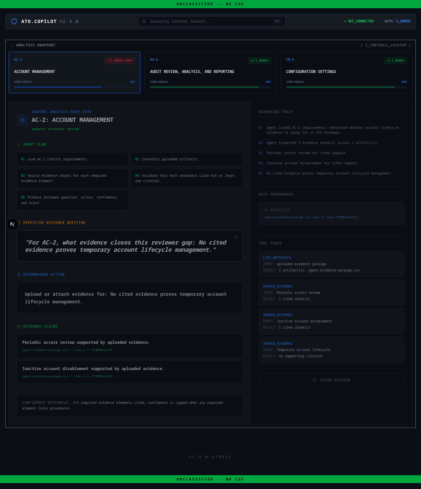

# ATO-Copilot

High-density security evidence intelligence for IL6 and FedRAMP workloads.



ATO-Copilot is a **Mission Terminal** for automating evidence readiness in the Authority to Operate (ATO) lifecycle. It transforms the "documentation hunt" into an evidence-driven workflow by mapping unstructured artifacts to NIST 800-53 controls with line-level provenance and reviewer scrutiny prediction.

## 🚀 The 90-Second Pitch

Compliance packages fail slowly because evidence is scattered and reviewers ask predictable questions too late. ATO-Copilot turns prep into a focused security terminal:

- **Automated Mapping:** Instantly correlates logs, CSVs, and artifacts to NIST control families (AC-2, AU-6, CM-6).
- **Predictive Scrutiny:** Generates the difficult questions a reviewer is likely to ask *before* you submit.
- **Deep Traceability:** Provides a reasoning trace with source provenance (hashes, line numbers, row IDs).
- **Actionable Gaps:** Flags exactly what is missing and provides a concrete "Next Action."

## 🎥 Demo Video

<video src="docs/sample-evidence-demo-15s.mp4" controls width="100%"></video>

*Fallback link: [docs/sample-evidence-demo-15s.mp4](docs/sample-evidence-demo-15s.mp4)*

## 🛠️ MVP Stack

- **Frontend:** Next.js (App Router), Tailwind CSS, Lucide Icons.
- **Backend:** FastAPI (Python), Uvicorn.
- **Intelligence:** Deterministic JSON heuristics + Optional **OpenRouter** (GPT-4/5) for expanded reviewer guidance.
- **Design:** High-density, dark-mode terminal aesthetic (`#0B0E14`).

## ⚙️ Configuration & Model Insights

The terminal can enrich deterministic mappings with live AI-generated reviewer guidance. It uses the golden dataset as the source of truth, then asks a model to generate the "Interrogatory Phase" questions.

1. **Setup Environment:**
   ```bash
   cp .env.example .env.local
   ```

2. **Configure `.env.local`:**
   ```bash
   USE_MODEL_INSIGHTS=true
   OPENROUTER_API_KEY=your-key-here
   OPENROUTER_MODEL=openai/gpt-5.2
   ```

## 📁 Repository Structure

- `docs/PRD.md` - Product requirements and design ethos.
- `docs/golden_dataset.json` - Deterministic demo source of truth.
- `docs/sample-evidence/` - Mock logs/CSVs for live upload demos.
- `api/` - FastAPI backend logic and agentic evidence review.
- `app/` - Next.js frontend terminal UI.

